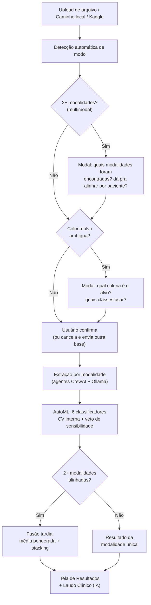
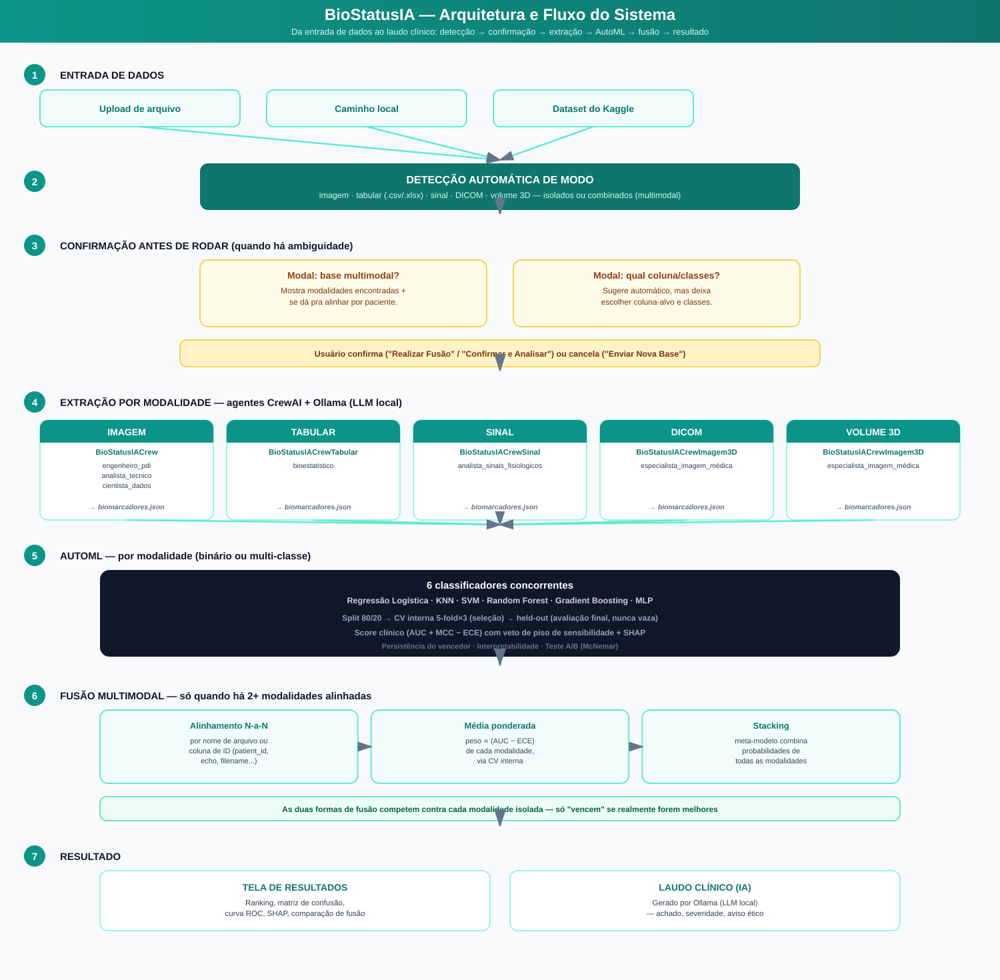

# BioStatusIA v3

> Sistema de Apoio à Decisão Clínica (CDSS) para análise automatizada de dados biomédicos —
> imagens, sinais temporais, DICOM, volumes 3D e dados tabulares, isolados ou combinados
> (fusão multimodal) — com IA multi-agente local, AutoML de 6 modelos (binário ou multi-classe)
> e laudos clínicos gerados por IA.

Pipeline orquestrado por agentes CrewAI rodando sobre um LLM local (Ollama), com classificação
AutoML (6 modelos, validação cruzada aninhada, métricas clínicas enriquecidas), fusão multimodal
tardia entre até 5 modalidades diferentes, e interface web Flask.

Projeto acadêmico de mestrado em IA na Saúde — Fortaleza, CE.

> **Metodologia:** o projeto adota **Spec-Driven Development (SDD)** — as especificações vivem
> em `docs/specs/` (constituição + spec/plan/tasks por página) e são a fonte da verdade para a
> evolução do sistema.

---

## Índice

1. [Princípio fundamental](#princípio-fundamental)
2. [Fluxograma e arquitetura visual](#fluxograma-e-arquitetura-visual)
3. [O que o sistema aceita](#o-que-o-sistema-aceita)
4. [Modos detectados automaticamente](#modos-detectados-automaticamente)
5. [Arquitetura — pipeline agentificado](#arquitetura--pipeline-agentificado)
6. [AutoML — o motor de treino](#automl--o-motor-de-treino)
7. [Fusão multimodal](#fusão-multimodal)
8. [Escolha de coluna-alvo e classes](#escolha-de-coluna-alvo-e-classes)
9. [Classificação binária e multi-classe](#classificação-binária-e-multi-classe)
10. [Biomarcadores extraídos por família](#biomarcadores-extraídos-por-família)
11. [Robustez e tratamento de erros](#robustez-e-tratamento-de-erros)
12. [Interface web](#interface-web)
13. [Rotas da API Flask](#rotas-da-api-flask)
14. [Stack tecnológica](#stack-tecnológica)
15. [Instalação](#instalação)
16. [Como rodar](#como-rodar)
17. [Testes](#testes)
18. [Estrutura do projeto](#estrutura-do-projeto)

---

## Princípio fundamental

**O sistema aceita qualquer combinação de tipos de dado em escopo.** Ao receber uma entrada, ele:

1. Detecta automaticamente a estrutura, a(s) família(s) de dado presentes, e se há mais de uma
   modalidade junto (multimodal).
2. Se houver ambiguidade sobre qual coluna é a classe-alvo (ou quais classes usar dentro dela),
   **pergunta antes de rodar** o pipeline pesado — nunca assume silenciosamente.
3. Se for multimodal, **confirma com o usuário** quais modalidades foram encontradas e se dá
   para alinhá-las pela mesma amostra/paciente, antes de processar.
4. Carrega e normaliza os dados de cada modalidade e extrai biomarcadores específicos da
   família detectada.
5. Treina 6 classificadores concorrentes com avaliação enriquecida (quando há rótulos e
   amostras suficientes) — suporta classificação **binária ou multi-classe**.
6. Se for multimodal e as amostras alinharem, calcula a **fusão tardia** entre as modalidades
   (além de cada uma isolada), mostrando se a fusão realmente ajuda.
7. Gera laudo preliminar via agentes de IA especializados por família.

A análise estatística sempre roda. O treino de classificadores só ocorre com rótulos e
amostras suficientes. O laudo IA roda apenas quando há sinal, imagem ou dado tabular
disponível.

---

## Fluxograma e arquitetura visual

### Fluxo de decisão, do upload ao resultado



### Arquitetura completa do sistema



---

## O que o sistema aceita

| Tipo de dado | Formatos aceitos | Exemplos de uso |
|---|---|---|
| **Imagem** | `.png`, `.jpg`, `.jpeg`, `.bmp`, `.tif`, `.tiff` | Raio-X, ultrassom, fotos clínicas |
| **Dados tabulares** | `.csv`, `.txt`, `.tsv`, `.xlsx` | Prontuário, exames laboratoriais |
| **Sinal biomédico** | `.edf`, `.bdf`, `.mat`, `.hea`, `.dat`, `.cnt`, `.eeg`, `.rec`, `.c3d`, `.set`, `.xml` | ECG, EEG, EMG, EOG, PPG, pressão arterial, espirometria |
| **DICOM** | `.dcm` | Imagens médicas padrão hospitalar |
| **Volume 3D** | `.nii`, `.nii.gz`, `.mha` | Tomografia (CT), ressonância (MRI) |
| **Compactado** | `.zip` | Extraído automaticamente antes da detecção |

**Formas de enviar:** upload direto, caminho local no servidor, ou download automático de um
dataset do Kaggle (com validação e correção automática de link malformado).

**Detecção de formato é por conteúdo, não por extensão** — um arquivo `.csv` cujo conteúdo real
é um Excel binário (ou vice-versa) é lido corretamente de qualquer forma, verificando a
assinatura real do arquivo (`carregar_csv` em `pipeline/dados_tabulares.py`).

**Robustez na leitura:**
- Detecta sozinho se a tabela tem cabeçalho ou não (datasets de benchmark como o ECG5000 vêm
  sem cabeçalho — a primeira linha já é dado).
- Múltiplos arquivos tabulares na mesma base são todos considerados — o sistema escolhe o que
  realmente casa com as outras modalidades (`_melhor_indice_tabular` em `app.py`), em vez de
  assumir que só existe um arquivo relevante.
- Aceita bases desbalanceadas sem quebrar (SMOTE/ADASYN entram automaticamente).

---

## Modos detectados automaticamente

| Modo | Entrada | O que roda |
|---|---|---|
| `imagem_unica` | Uma imagem `.png/.jpg/.bmp/.tif` | `BioStatusIACrew` (radiômica) |
| `imagens_soltas` | Pasta/ZIP com imagens sem rótulos | `BioStatusIACrew` |
| `dataset_rotulado` | Pasta com subpastas `benign/` + `malignant/` | `BioStatusIACrew` + AutoML |
| `tabular` | CSV/TXT/TSV/XLSX com features clínicas | `BioStatusIACrewTabular` + AutoML |
| `sinal_temporal` | ECG / EEG / EMG / ... | `BioStatusIACrewSinal` + AutoML |
| `imagem_dicom_2d` | DICOM único (Raio-X, Mamografia...) | `BioStatusIACrewImagem3D` |
| `volume_3d` | NIfTI / MHA / série DICOM ≥10 arquivos | `BioStatusIACrewImagem3D` |
| `multimodal` | Exatamente Imagem + Tabular juntos | `BioStatusIACrew` + tabular + **fusão** |
| `multimodal_expandido` | Qualquer OUTRA combinação de 2+ famílias (ex.: sinal+DICOM, imagem+sinal, 3+ famílias) | Roteamento genérico por modalidade + **fusão N-a-N** |

Entradas fora de escopo ou vazias caem em `invalido`, com uma mensagem explicando o motivo (não
um erro genérico).

Nomes de pastas reconhecidos como rótulo — Benignas: `benign`, `benigno`, `normal`, `negative`,
`0` | Malignas: `malignant`, `malign`, `maligno`, `abnormal`, `positive`, `1` (busca recursiva).
Se a imagem não tiver rótulo de pasta, ela ainda pode participar de uma fusão multimodal — o
rótulo pode vir de outra modalidade alinhada (ex.: uma tabela com o diagnóstico real).

---

## Arquitetura — pipeline agentificado

**5 Crews, 8 agentes, 8 tools** — todos em processo `sequential`. Os agentes se comunicam via
JSONs em `static/runs/run_<timestamp>/` — o LLM recebe resumos em texto, nunca os dados brutos.

### Crews de Sinal e Imagem médica

```
BioStatusIACrewSinal (sinais temporais)
  analista_sinais_fisiologicos
    └─ FerramentaExtrairSinalTemporal → biomarcadores_temporal.json
  radiologista_ia → laudo Markdown

BioStatusIACrewImagem3D (DICOM 2D / volume 3D)
  especialista_imagem_medica
    ├─ FerramentaExtrairDICOM        → biomarcadores_dicom.json
    └─ FerramentaExtrairVolume3D     → biomarcadores_volumetrico.json
  radiologista_ia → laudo Markdown
```

### Crew de Imagem (radiômica)

```
BioStatusIACrew
  engenheiro_pdi       → analise_base.json     (decide a estratégia de pré-processamento)
  analista_tecnico     → biomarcadores.json    (extração em lote via a estratégia decidida)
  cientista_dados      → metricas.json         (treino/comparação inicial de modelos)
  radiologista_ia      → laudo Markdown
```

### Crew Tabular e Laudo Interativo

```
BioStatusIACrewTabular
  bioestatistico → FerramentaAnaliseTabular → laudo Markdown

BioStatusIACrewInterativo
  radiologista_ia_interativo (sem tool, max_iter=4)
  → laudo de amostra avulsa (5 seções obrigatórias)
```

### Os 8 agentes (`config/agents.yaml`)

| Agente | Papel | O que faz |
|---|---|---|
| `engenheiro_pdi` | Engenheiro de PDI | Analisa estatisticamente a base de imagens (ruído, contraste, outliers) e decide a estratégia de pré-processamento — nunca aplica uma técnica sem evidência numérica que a justifique. |
| `analista_tecnico` | Analista de Bioestatística/Visão Computacional | Executa a extração em lote de biomarcadores radiômicos usando a estratégia definida pelo engenheiro de PDI. |
| `cientista_dados` | Cientista de Dados / ML Clínico | Treina e compara classificadores sobre os biomarcadores extraídos, relatando limitações de tamanho amostral. |
| `radiologista_ia` | Radiologista IA | Interpreta os dados quantitativos (ex.: solidez, entropia) e redige o laudo preliminar em linguagem médica, sempre com cautela profissional e sugestão de correlação clínica — nunca afirma diagnóstico fechado. |
| `bioestatistico` | Bioestatístico Clínico | Interpreta dados tabulares clínicos, identifica variáveis mais discriminativas entre classes, com rigor estatístico. |
| `analista_sinais_fisiologicos` | Engenheiro de Sinais Biomédicos | Carrega, normaliza e extrai biomarcadores multi-domínio (tempo e frequência) de sinais temporais como ECG/EEG/EMG. |
| `especialista_imagem_medica` | Especialista em Imagem Médica | Extrai biomarcadores de DICOM 2D e volumes 3D (radiômica + morfologia 3D). |
| `radiologista_ia_interativo` | Radiologista IA (laudo de amostra) | Gera o laudo de uma amostra específica, sem ferramenta própria — usa o que já foi extraído. |

### As 8 tools (`tools/`)

`analise_base_tool`, `extracao_tool`, `treino_tool`, `tabular_tool`, `sinais_temporais_tool`,
`dicom_tool`, `volumetrico_tool`, e o roteamento genérico direto em `app.py` para os modos
multimodal (não passa necessariamente por uma tool de crew específica — extrai diretamente via
`extrair_lote_temporal`/`extrair_lote_dicom`/`extrair_lote_volumetrico`, ver seção de Fusão).

---

## AutoML — o motor de treino

Dois pontos de entrada equivalentes, ambos delegando o cálculo de métricas para a mesma função
central (`calcular_metricas_classificacao`, em `avaliacao_modelos.py`):

- **`pipeline/classificador.py::treinar_vetores()`** — usado pelo modo tabular e pela
  classificação tabular dentro de multimodal.
- **`pipeline/avaliacao_modelos.py::avaliar_modelos()`** — usado pelos modos de imagem, sinal,
  DICOM e volume.

### Os 6 classificadores

| Modelo | Tipo |
|---|---|
| Regressão Logística | Linear |
| KNN | Baseado em distância |
| SVM (RBF) | Kernel não-linear |
| Random Forest | Ensemble (100 árvores) |
| Gradient Boosting | Boosting (100 estimadores) |
| MLP | Rede neural (64×32) |

### Protocolo de validação (sem vazamento de dados)

1. **Split externo** 80/20 — o fold de teste (held-out) é separado antes de qualquer
   escalonamento, imputação ou balanceamento.
2. **Seleção do vencedor** decidida **inteiramente dentro do treino (80%)**, via CV interna
   repetida (5-fold × 3 repetições, `RepeatedStratifiedKFold`) — escala, imputação e
   balanceamento são reajustados a cada fold, nunca vendo os dados de validação daquele fold.
3. **Avaliação final** roda no fold de teste held-out (20%), que nunca influenciou a escolha do
   vencedor — evita o problema clássico de "a mesma partição escolhe e avalia".
4. **Imputação** de valores ausentes ajustada só no treino (`imputar_treino_teste`).
5. **Seleção de features via SHAP** (`selecionar_features_shap`) — treina um Random Forest
   "sonda" só no treino, rankeia por importância SHAP, mantém as mais relevantes. Funciona tanto
   para binário quanto multi-classe (ver seção dedicada abaixo).
6. **Balanceamento** (SMOTE/ADASYN) só no treino, quando há desbalanceamento de classes.

### Critério de seleção do vencedor (veto de piso de sensibilidade)

O vencedor não é escolhido só pela maior acurácia. `calcular_score_clinico()` combina AUC + MCC
− erro de calibração (ECE); `selecionar_melhor_modelo()` aplica um **veto**: só entram na
disputa os candidatos que atingem um piso mínimo de sensibilidade (padrão 0.80). Se **nenhum**
candidato atingir esse piso, o sistema não coroa um vencedor arbitrário — sinaliza isso
explicitamente (`piso_sensibilidade_atingido: False`) na interface.

### Métricas calculadas por modelo

Acurácia, sensibilidade, especificidade, precisão, recall, F1, AUC, MCC (Matthews), Kappa
(Cohen), ECE (Expected Calibration Error), latência de inferência, tempo de treino, e o score
clínico. Para multi-classe, sensibilidade/especificidade/precisão/recall/F1 viram médias entre
as classes (ver seção de multi-classe).

**Interpretabilidade:** SHAP no modelo vencedor. **Teste A/B:** McNemar entre o vencedor e um
modelo baseline. O modelo vencedor é persistido em `models/vencedor_<familia>.pkl`
(`pipeline/inferencia.py`) para inferência de amostras individuais.

---

## Fusão multimodal

Quando a base tem **2 ou mais modalidades** (imagem, tabular, sinal, DICOM, volume, em qualquer
combinação), o sistema tenta ir além de analisar cada uma isoladamente.

### Por que fusão tardia (não fusão precoce)

Concatenar features de todas as modalidades num vetor só ("fusão precoce") aumentaria a
dimensionalidade sem aumentar o número de amostras — datasets clínicos costumam ser pequenos, o
que pioraria o overfitting. Em vez disso, o BioStatusIA usa **fusão tardia (decision-level)**:
cada modalidade treina seu próprio classificador (com toda a validação/calibração já descrita),
e as **probabilidades previstas** de cada uma são combinadas depois.

### Alinhamento (pré-requisito)

Antes de fundir, o sistema precisa confirmar que a amostra `i` de cada modalidade é realmente a
mesma pessoa/exame (`pipeline/alinhamento_multimodal.py`):

- Modalidades baseadas em arquivo (imagem, sinal, DICOM, volume) são casadas pelo **nome do
  arquivo**, normalizado (sem caminho, sem extensão, case-insensitive).
- A modalidade tabular é casada por uma **coluna de identificador** reconhecida no
  CSV/planilha (`id`, `patient_id`, `echo`, `filename`, entre outras variações comuns).
- O alinhamento final é a **intersecção** das chaves presentes em todas as modalidades
  participantes — modalidades sem identificador utilizável ficam de fora, mas isso é reportado
  explicitamente, nunca fundido às cegas.
- Quando há **múltiplos arquivos tabulares** na base, o sistema tenta todos e usa o que
  realmente tiver mais amostras em comum com as outras modalidades.

### As duas formas de fusão (`pipeline/fusao_multimodal.py`)

1. **Média ponderada pela confiabilidade** — o peso de cada modalidade é proporcional a
   `AUC − ECE` (medidos via CV interna out-of-fold), normalizado para somar 1. Modalidades mais
   discriminativas e mais bem calibradas pesam mais, sem nunca zerar completamente uma
   modalidade mais fraca.
2. **Stacking** — um meta-modelo (Regressão Logística) treinado nas probabilidades
   out-of-fold de cada modalidade, aprendendo a combiná-las de um jeito potencialmente mais
   rico que a média simples.

Ambas são comparadas contra cada modalidade isolada no mesmo fold de teste held-out, usando o
mesmo veto de piso de sensibilidade do AutoML normal — **a fusão só "vence" se realmente for
melhor**, nunca é forçada a ser a escolha final.

### Antes de rodar: modal de confirmação

Ao detectar uma base multimodal, o sistema **não roda o pipeline pesado direto** — mostra um
modal com:
- Quais modalidades foram encontradas, com contagem de arquivos/linhas de cada uma.
- Se dá para alinhar por paciente (e quantas amostras casaram), ou o motivo exato de não dar.
- A escolha de coluna-alvo e classes (ver próxima seção), quando aplicável.

O usuário confirma ("Realizar Fusão") ou cancela ("Enviar Nova Base") antes de qualquer
processamento pesado (agentes de IA + AutoML) começar.

---

## Escolha de coluna-alvo e classes

A heurística automática de detecção de rótulo (`detectar_schema`) olha por nomes de coluna
reconhecidos ou, na falta deles, a última coluna com 2 a 10 valores únicos — o que nem sempre é
a coluna clinicamente relevante (ex.: um dataset com "Medical Condition" — o diagnóstico — e
"Test Results" como última coluna escolheria "Test Results" por padrão).

Por isso, sempre que houver ambiguidade real, o sistema pergunta antes de rodar:

- **2 ou mais colunas** plausíveis como alvo (2 a 10 valores únicos cada), OU
- **1 única coluna**, mas com **mais de 2 classes**.

O modal mostra um seletor com todas as colunas candidatas (nome + número de classes), e — se a
coluna escolhida tiver mais de 2 classes — uma lista de checkboxes com **cada classe e sua
contagem real de amostras**, todas marcadas por padrão (fazem parte do resultado final), com um
"Selecionar todas" para marcar/desmarcar tudo de uma vez. A escolha é aplicada de forma
consistente em todos os pontos reais de treino: tabular puro, multimodal, e dentro da fusão —
inclusive tendo prioridade sobre o rótulo que outra modalidade já tivesse (ex.: uma imagem com
pasta benign/malignant não sobrescreve a coluna que o usuário escolheu explicitamente).

---

## Classificação binária e multi-classe

O sistema treina tanto problemas **binários** (2 classes) quanto **multi-classe** (3 ou mais),
em qualquer modo — tabular, imagem, sinal, DICOM, volume, e na fusão multimodal.

| Métrica | Binário (2 classes) | Multi-classe (3+) |
|---|---|---|
| Sensibilidade / Especificidade | Significado clínico exato (recall da classe positiva/negativa) | Médias — recall macro / especificidade one-vs-rest média |
| Precisão / Recall / F1 | Da classe positiva | Média macro entre as classes |
| AUC | `roc_auc_score` padrão | `roc_auc_score` com `multi_class='ovr'`, média macro |
| MCC / Kappa | Nativo do scikit-learn | Nativo do scikit-learn (já suporta multi-classe) |
| ECE (calibração) | Baseado na probabilidade da classe positiva | Baseado na confiança da predição (probabilidade da classe mais provável) vs. acerto — generalização padrão do ECE |
| Matriz de confusão | 2×2, com grid visual VN/FP/FN/VP | N×N, com os nomes reais das classes |
| Curva ROC | Sim | Não se aplica da forma tradicional — o AUC (macro) aparece na tabela de métricas |
| SHAP (importância de features) | Magnitude da classe positiva | Média da magnitude entre **todas** as classes |

A função central `calcular_metricas_classificacao()` (`avaliacao_modelos.py`) decide qual
caminho seguir conforme o número de classes — o caso binário é **bit-a-bit idêntico** ao cálculo
usado antes dessa generalização (testado e confirmado).

---

## Biomarcadores extraídos por família

### Sinais temporais
- Tempo: RMS, média, desvio, skewness, kurtosis, pico-a-pico, SNR_dB
- Frequência: PSD (Welch), centroide espectral, 4 bandas de potência, freq. dominante
- ECG: FC_bpm, RMSSD, SDNN, pNN50, R-peaks
- EEG: bandas delta/theta/alpha/beta/gamma, ratio alpha/beta
- EMG: RMS envelope, frequência mediana
- Espirometria: FVC, FEV1, FEV1/FVC, PEF

### DICOM 2D
- 9 biomarcadores radiômicos (morfologia, GLCM, distribuição de intensidade)
- Densidade alta (%), gradiente médio, uniformidade, modalidade DICOM
- Pixel spacing, hounsfield_range, janelamento HU automático

### Volume 3D
- Estatísticas globais: média, desvio, mediana, skewness, kurtosis, P5/P95, voxels_altos
- GLCM por plano ortogonal (axial, coronal, sagital)
- Morfologia 3D: volume da lesão (mm³), esfericidade, bounding box axes

### Imagem comum (radiômica)

| Grupo | Métrica | Sinal de malignidade |
|---|---|---|
| Morfologia | Circularidade | Baixa (<0.7) |
| Morfologia | Solidez | Baixa (margens irregulares) |
| Textura (GLCM) | Contraste | Alto |
| Textura (GLCM) | Homogeneidade | Baixa |
| Textura (GLCM) | Energia | Baixa |
| Textura (GLCM) | Entropia | Alta (tecido heterogêneo) |
| Distribuição | SNR | Qualidade do sinal (não diagnóstico) |
| Distribuição | Assimetria | Complementar |
| Distribuição | Curtose | Complementar |

Regra geral: **baixa solidez + alta entropia → suspeito de malignidade**.

Para sinal, DICOM e volume dentro de uma fusão multimodal (fora do fluxo de crew específico), o
sistema usa `vetorizar_biomarcadores_generico()` (`classificador.py`) — achata qualquer dict
aninhado de biomarcadores num vetor numérico, sem precisar de um vetorizador escrito à mão por
modalidade.

### Pré-processamento adaptativo (imagens)

O `engenheiro_pdi` analisa a base antes da extração e escolhe a estratégia:

| Condição | Estratégia |
|---|---|
| Ruído médio > 0.05 | Non-Local Means |
| Ruído ≤ 0.05 | Gaussian blur 5×5 |
| Outliers > 10% (IQR) | Normalização percentil 1–99% |
| Outliers ≤ 10% | Min-max [0,1] |
| Contraste médio < 30 | CLAHE |
| Contraste ≥ 30 | Sem equalização |
| Tamanhos heterogêneos | Resize 256×256 obrigatório |

---

## Robustez e tratamento de erros

- **Sem erro genérico 500:** um `@app.errorhandler(500)` global captura qualquer exceção não
  prevista e devolve uma mensagem JSON explicável (compatível com o modal do frontend) em vez
  da página padrão do Flask; o erro completo ainda vai para o log do servidor.
- **Validação de entrada** (`validacao.py`) com mensagens claras e exemplo do formato correto —
  inclusive auto-correção de link do Kaggle colado errado (ex.: URL completa em vez do
  `dono/dataset`).
- **Detecção de formato por conteúdo**, não por extensão (csv/xlsx trocados funcionam).
- Todo o fluxo foi testado ponta a ponta com a estrutura real de datasets publicados no Kaggle
  (não só dados sintéticos), incluindo casos com nomenclatura de coluna incomum e múltiplos
  arquivos tabulares relevantes na mesma base.

---

## Interface web

Design "clínico moderno" (paleta teal Material, tipografia Inter, ícones Material Symbols).
Barra de navegação com **Dashboard** (upload) e **Histórico**.

### Telas

- **Tela 1 — Upload** (`/`): drag & drop, campo de caminho local, seletor de tipo de sinal,
  integração com Kaggle. Antes de rodar, pode abrir um modal de confirmação (multimodal e/ou
  escolha de coluna-alvo/classes) — ver seções acima.
- **Tela 2 — Resultados** (`/resultados/<id>`): cabeçalho de contexto + abas com estatísticas,
  pré-processamento, AutoML (ranking, matriz de confusão, curva ROC quando aplicável) e laudo.
  Quando é multimodal, ganha uma seção extra comparando cada modalidade isolada com as duas
  formas de fusão.
- **Tela 3 — Histórico** (`/historico`): lista de todas as análises anteriores.

### Aba de Laudo

Gera 5 seções obrigatórias no laudo de amostra: Achado Principal, Severidade 1–5, Comparação com
Referência, Recomendação Imediata e Aviso Ético. O **Laudo Populacional**
(`/laudo_populacional/<id>`) é determinístico — montado a partir do `pipeline_json` persistido,
sem depender do LLM.

---

## Rotas da API Flask

| Método | Rota | Descrição |
|---|---|---|
| `GET` | `/` | Tela 1 — Upload |
| `POST` | `/analisar` | Valida, opcionalmente pede confirmação (JSON), e dispara o pipeline → redireciona para `/resultados/<id>` |
| `GET` | `/resultados/<id>` | Tela 2 |
| `GET` | `/historico` | Tela 3 — Histórico |
| `GET` | `/api/historico` | JSON com os últimos resultados |
| `GET` | `/api/exemplos/<id>` | Exemplos individuais do dataset da análise |
| `GET` | `/laudo_populacional/<id>` | Laudo populacional determinístico |
| `GET` | `/relatorio_pdf/<id>` | Baixa o relatório final em PDF, combinando todas as abas |
| `POST` | `/laudo_amostra` | Laudo de amostra avulsa (upload) ou de análise existente |

---

## Stack tecnológica

| Camada | Tecnologia |
|---|---|
| Backend | Python 3.10–3.12, Flask ≥3.0 |
| LLM local | Ollama (`qwen2.5:3b`) |
| Agentes | CrewAI ≥0.203 (5 crews, 8 agentes) |
| Sinais fisiológicos | MNE-Python, wfdb, scipy |
| Imagens DICOM | pydicom |
| Volumes 3D | nibabel, SimpleITK |
| Visão computacional | OpenCV (headless), scikit-image |
| AutoML | scikit-learn (6 modelos) |
| Balanceamento / Interpretabilidade | imbalanced-learn, SHAP |
| Planilhas | openpyxl (leitura de `.xlsx`, detecção por conteúdo) |
| Relatório PDF | reportlab (Platypus) |
| Banco de dados | SQLite |
| Gerenciador de pacotes | `uv` |
| Frontend | HTML5 + Tailwind CSS (CDN), Inter, Material Symbols |
| Gráficos | Plotly.js (CDN) |

> **Nota:** Tailwind CSS e Plotly.js são carregados via CDN — é necessário acesso à internet no
> primeiro carregamento das telas.

---

## Instalação

### Pré-requisitos

- Python 3.10–3.12
- [uv](https://github.com/astral-sh/uv) (recomendado) ou `pip` puro
- [Ollama](https://ollama.com) com o modelo usado para os laudos:
  ```bash
  ollama pull qwen2.5:3b
  ```

### Setup com `uv` (recomendado)

```bash
git clone <url-do-repositorio>
cd BioStatusIA-atualizacao_features
uv sync
```

### Setup alternativo com `pip` puro

```bash
python -m venv .venv
# Windows PowerShell:
.venv\Scripts\Activate.ps1
# Linux/macOS:
source .venv/bin/activate

pip install -e .
```

### Configuração `.env`

Crie um arquivo `.env` na raiz do projeto:

```env
MODEL=ollama/qwen2.5:3b
API_BASE=http://localhost:11434
PYTHONUTF8=1
PYTHONIOENCODING=utf-8
```

---

## Como rodar

### Servidor web (modo principal)

Com `uv`:
```bash
uv run flask --app src/biostatusia/app.py run --port 5000
```

Sem `uv` (venv ativado):
```bash
flask --app src/biostatusia/app.py run --port 5000
```

Abra `http://localhost:5000`.

> **Pré-requisitos de execução:** o Ollama precisa estar rodando (`http://localhost:11434`) com
> o modelo configurado disponível, e a máquina precisa de acesso à internet para os assets de
> CDN (Tailwind, Plotly). Sem o Ollama, as etapas de laudo IA falham; sem internet, as telas não
> renderizam corretamente.

### CLI retrocompatível (sem interface web)

```bash
uv run biostatsia
```

### Datasets de teste local incluídos

- **WBCD-50** (50 amostras tabulares): `dataset_teste_csv/wbcd_50.csv`

Outros datasets de teste (ex.: `dataset_teste_busi/`, usado por `tests/test_tools.py`) não são
distribuídos com o projeto (listados no `.gitignore`, tipicamente por conterem imagens reais que
não podem ser redistribuídas) — os testes que dependem deles pulam automaticamente
(`pytest.skip`) quando a pasta não existe.

---

## Testes

### Suíte automatizada (`pytest`)

Suíte rápida (a maior parte roda em segundos, sem precisar de Ollama nem internet):

```bash
uv sync
uv run pytest
```

Ou, sem `uv` (venv ativado):
```bash
pytest
```

**Comandos úteis:**

```bash
# Tudo
uv run pytest

# Só os testes rápidos (sem Ollama/Kaggle/download)
uv run pytest -m "not slow"

# Um arquivo específico
uv run pytest tests/test_multiclasse.py -v

# Um teste específico dentro de um arquivo
uv run pytest tests/test_fusao_multimodal.py::test_fusao_2_modalidades_supera_melhor_isolada
```

> Dois testes (`test_f3_dicom`, `test_f4_volume` em `test_contrato_sinais.py`) exigem a
> biblioteca `nibabel` — se não estiver instalada, esses dois falham; isso não indica problema
> no restante do sistema. Instale com `pip install nibabel --break-system-packages` se quiser
> que passem também.

### O que cada arquivo de teste cobre

| Arquivo | Cobertura |
|---|---|
| `test_deteccao_modo.py` | Os modos de `detectar_estrutura()` + predicados de `io_utils` |
| `test_tabular.py` | Schema por nome/fallback, separador, encoding, NaN |
| `test_coluna_alvo.py` | Detecção de colunas candidatas a alvo, override manual do rótulo |
| `test_filtro_classes.py` | Contagem real por classe, filtro para classes específicas |
| `test_selecao_livre_classes.py` | Seleção livre de classes (sem trava em 2), incluindo treino multi-classe real |
| `test_multiclasse.py` | Métricas/treino/fusão/SHAP para binário e multi-classe, nos 4 pontos do pipeline |
| `test_alinhamento_multimodal.py` / `test_alinhamento_multi_tabular.py` | Alinhamento N-a-N entre modalidades, múltiplos arquivos tabulares |
| `test_fusao_multimodal.py` / `test_fusao_respeita_coluna_alvo.py` | Fusão tardia (2 a N modalidades), prioridade da coluna-alvo escolhida |
| `test_xlsx_e_erro500.py` | Suporte a `.xlsx`/detecção por conteúdo, blindagem contra erro 500 |
| `test_classificador.py` | `treinar_vetores` — métricas, campeão por score clínico, guarda de amostras insuficientes |
| `test_relatorios.py` | Formatação de métricas, pódio ordenado, laudo determinístico, correlações |
| `test_inferencia.py` | Persistência/carregamento do modelo vencedor |
| `test_contrato_sinais.py` | `SinalNormalizado` por família |
| `test_rotas.py` | Rotas Flask (GET, 404/400, banco isolado) |
| `test_crews.py` | Fiação das 5 crews + guardrails (radiologistas sem tools, `max_iter`) |
| `test_tools.py` | Contrato de filesystem das tools (cadeia de JSONs) — pula sem `crewai` ou sem o dataset local |
| `test_guardrails.py` | Aviso ético nas telas, 5 seções do laudo |
| `test_validacao.py` | Validação de entrada (Kaggle ID, caminho, extensão) |

### Scripts de validação manuais

Além da suíte de `pytest`, há scripts que rodam o pipeline de ponta a ponta:

| Comando | Requer | O que valida |
|---|---|---|
| `uv run python tests/test_todos_tipos.py` | — | Leitura → extração → AutoML para cada tipo |
| `uv run python tests/test_direct.py` | — | Pipeline puro (base, extração, AutoML, tabular, sinal) |
| `uv run python tests/run_tests.py` | Ollama | Crews completas ponta a ponta |
| `uv run python tests/test_large_image_dataset.py` | Internet / KaggleHub | Pipeline de imagem sobre dataset grande do Kaggle |

---

## Estrutura do projeto

```
src/biostatusia/
├── app.py                       # Rotas Flask, orquestração da requisição /analisar
├── crew.py                      # Definição das 5 crews CrewAI
├── main.py                      # CLI retrocompatível
├── validacao.py                 # Validação de entrada (upload, caminho, Kaggle ID)
├── config/
│   ├── agents.yaml              # Os 8 agentes (role/goal/backstory)
│   └── tasks.yaml               # Tasks de cada crew
├── tools/                       # 7 tools CrewAI (uma por etapa/família)
├── pipeline/
│   ├── io_utils.py              # Detecção de família de arquivo, listagem, rótulo por pasta
│   ├── io_sinais.py             # Carregamento/normalização de sinais (SinalNormalizado)
│   ├── leitura_*.py             # Leitura específica (DICOM, temporal, volumétrico)
│   ├── extracao_*.py            # Extração de biomarcadores por família
│   ├── dados_tabulares.py       # Schema, extração de features, seleção SHAP, imputação
│   ├── avaliacao_modelos.py     # AutoML (imagem/sinal/DICOM/volume) + métricas centrais
│   ├── classificador.py         # AutoML (tabular) + vetorizador genérico de biomarcadores
│   ├── alinhamento_multimodal.py # Alinhamento N-a-N entre modalidades
│   ├── fusao_multimodal.py      # Fusão tardia (média ponderada + stacking)
│   ├── analise_base.py          # Análise estatística de pré-processamento
│   ├── preprocessamento.py      # Estratégias de pré-processamento de imagem
│   ├── relatorios.py            # Formatação de laudos/relatórios
│   ├── inferencia.py            # Persistência/carregamento do modelo vencedor
│   └── llm_timing.py            # Instrumentação de tempo (LLM vs. AutoML)
├── templates/                   # As 3 telas (Jinja2 + Tailwind + Plotly)
├── static/                      # Uploads e runs (JSONs intermediários dos agentes)
└── database.py                  # Persistência SQLite

tests/                           # Suíte pytest (ver seção Testes acima)
docs/specs/                      # Especificações (Spec-Driven Development)
dataset_teste_csv/               # Dataset de teste incluído
```

---

## Spec-Driven Development (SDD)

A evolução do sistema segue **SDD**: primeiro a especificação, depois o código. Artefatos em
`docs/specs/`:

- `constitution.md` — princípios invioláveis (contrato `SinalNormalizado`, rigor do AutoML,
  aviso ético, etc.)
- `README.md` — índice e fluxo (spec → plan → tasks → implementação)
- Uma pasta por página/fluxo, cada uma com `spec.md`, `plan.md` e `tasks.md`

## Aviso ético

Este é um sistema de **apoio** à decisão clínica — os laudos gerados são preliminares e nunca
substituem avaliação médica profissional. Todas as telas exibem esse aviso de forma visível.
